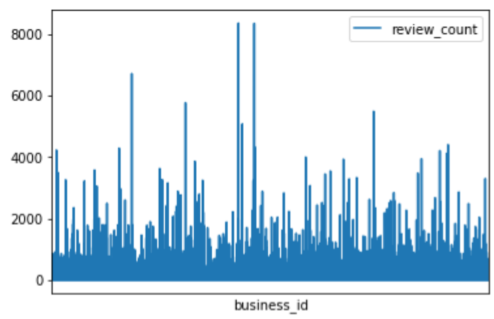
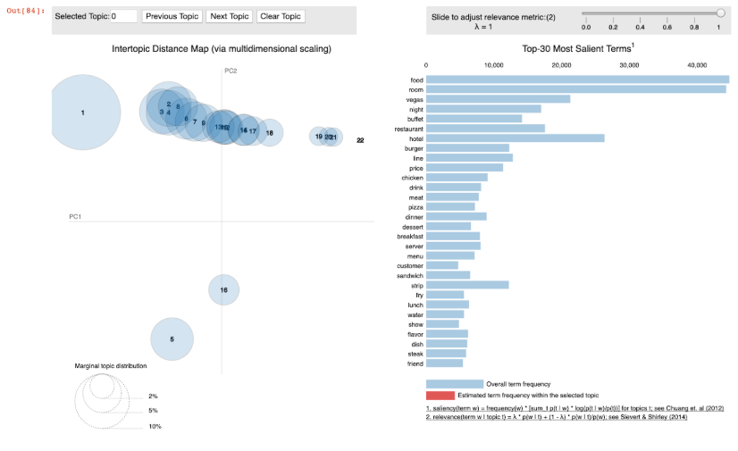
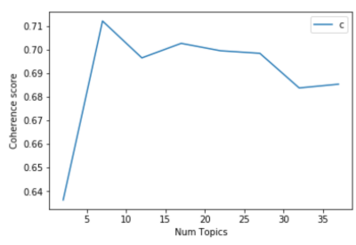
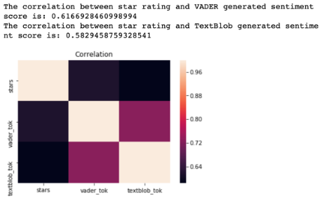
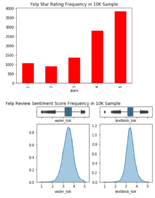
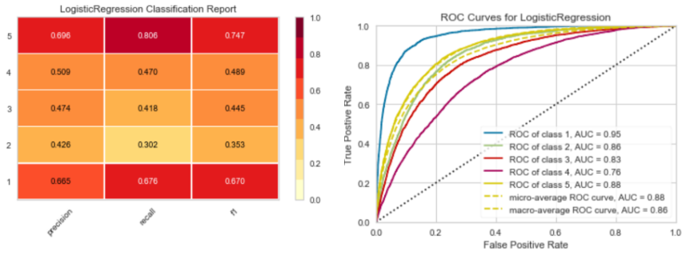
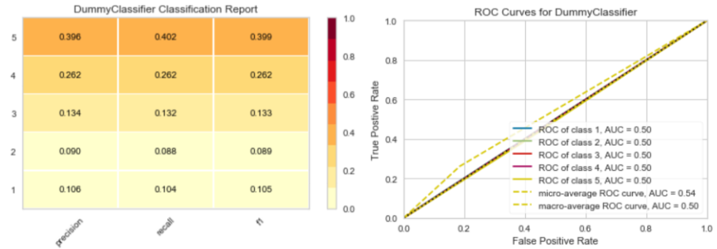

# CS89 Final Project: Analyzing Yelp Review Data

Abhimanyu Kapur, Nitasha Kochar, Evalyn Li

Note: My (Abhimanyu) contribution to this project was the data sampling, cleaning, pre-processing and classification+visualization. Most of the data files (including the sampled and processed files) were too large to upload on github, but the original datasets can be found on the [Yelp Dataset Challenge page](https://www.yelp.com/dataset). Using the *business* dataset, you can test our analyses and results. 

## Introduction

Yelp is a popular platform for crowd-sourcing reviews about local businesses. As reviews and star ratings are popular features for Yelp users to learn more about a business, we will explore what it means to determine the categories of businesses based solely on the reviews. We will also explore how to predict a review&#39;s star rating based on its text. Finally, we seek to understand how a review&#39;s text sentiment correlates with its star rating.

## Data

Through the [Yelp Dataset Challenge page](https://www.yelp.com/dataset), we have access to 192609 businesses and 6.6 million reviews. For the purposes of our project, we wanted to filter this dataset by focusing on the businesses with the most engagement (defined as the most number of user reviews). For this, we took the top 100 businesses from the &#39;business&#39; dataset provided by Yelp. We then used this to filter the reviews from the &#39;reviews&#39; dataset, leaving us with only reviews for the top 100 businesses. Finally, we filtered out all reviews which contained less than 40 characters, so that after cleaning there would be enough text per review for useful data analysis.

This left us with a dataset which looked like this:

 
 
This data was then randomly sampled into subsets ranging from 5000 to 100000 items.

## Methods

_Note: It will take a long time to run our code!_

**A**. **Topic Modeling (Code: topic\_model\_1)**

**Data file:** 2sample\_50000\_1.json

**Main questions:**

1. 1)By looking at a random sample of 50,000  Yelp reviews, can we recreate, or enhance the number of categories Yelp currently has on its website?
2. 2)Using these enhanced categories, can we categorize businesses?

_\* Yelp has 22 distinguished categories, each of which is subdivided into subcategories._

**Preprocessing:**

First, we attempted todiscern distinct categories from a random sample of 50,000 Yelp reviews from the top 100 businesses with the most engagement. We read these reviews into a pandas data frame and then visualized the most frequent words using the seaborn library. By analyzing the most frequent words, we saw that there are a lot of stopwords, which was a big sign that we should preprocess the text before any further analysis.

Our first step in preprocessing was to convert the text values into a list. Then we tokenized reviews  with the &#39;tokenize\_reviews&#39; function, which utilizes _gensim.utils.simple\_preprocess()__1_. We converted each review into a string and then passed the string into &#39;simple\_preprocess&#39;. Next, we created a bigram model and a trigram model. Then we created a list of stopwords using NLTK&#39;s stopwords and appended specific words to the list of stopwords from a popular online stopwords file called BucklySaltonSWL and from our own analysis of the most frequent yet unhelpful words in the reviews. We defined functions for removing stopwords, creating bigrams and trigrams, and for lemmatization, and then called these functions on the review data. We also decided to look only at nouns as they are more helpful in delineating distinct topics and would help reduce ambiguity in the meaning of certain words.  After all of this preprocessing, we again examined the most frequent words in the review text.

**Topic Modeling:**

_\*Note: topic numbers generated by our algorithms may change if the code is re-run._

First, we created a dictionary and corpus, which is generally needed for topic modeling. The corpus consists of all the review text in a bag of words format for each review. Gensim creates a unique ID for each word in the document and the resulting corpus shown is a mapping of [word\_id, word\_frequency].

To create the topic model, we initially used the Latent Dirilecht Allocation (LDA) model from the Gensim library and decided that, since we were trying to recreate or enhance the number of categories that Yelp currently has (22),  we should start there. We printed the keywords in each of the 22 topics so that we could then infer general topics from them.

A few topics that we inferred were:

0. Show

2. Meals

5. Dinner party

10. Food

12. Financial services

13. Nightlife

14. Hotel

15. Local flavor

16. Travel

17. Brunch

18. Restaurant

21. Fast food

To measure &quot;how good&quot; our model was, we computed the _coherency_ of the model, which was 0.4729. &quot;Topic Coherence&quot; refers to the degree of semantic similarity between the highest scoring keywords in a topic2. Evidently, the Gensim LDA model did not give us the best categories for our Yelp data and this is further emphasized in the visualization below, which we created using pyLDAvis. Since there are a lot of overlapping clusters, we can see that we were not able to create distinct enough topics from our model.

_Note: The topic numbers in the visualization  do not correspond to topic numbers above. However, topic 1 in the visualization corresponds to topic 14 listed above; topic 5 in the visualization corresponds to topic 15 listed above; and topic 16 in the visualization corresponds to topic 17 listed above._

 
 
We then tried different values for the parameters and found that increasing the number of passes and decreasing the number of topics increased coherence up to about 0.50, but we wanted that number to be a little higher.

**Mallet LDA Model**

After doing more research on different types of models and their successes, we then used **Mallet&#39;s** version of the LDA model, which has been shown to produce higher quality topics. Again, we wanted to start with finding 22 topics first.

_Example of topics with inferred names:_

5. Breakfast

1. Travel

8. Meat

0. Restaurant

6. Hotel room

3. Hotel service

16. Food

21. Seafood

14. Vacation

The coherence score for 22 topics using the Mallet model is 0.6993 We can see that coherence has increased tremendously with the  Mallet model, but we still have a lot of overlapping topics.

In order to find the optimal number of topics to use for the Mallet model, we computed the relevant coherence scores for different numbers of topics. We created a function called &#39;compute\_coherence&#39;, which takes in a Gensim dictionary, Gensim corpus, a list of texts, and a max number of topics, and then returns a list of LDA topic models, the number of topics used for that model, and their corresponding coherence values. We created a graph to visualize the number of topics and their corresponding coherence scores to determine the best number of topics to use for the topic model.
 
 
Lastly, we wanted to see the distribution of documents for each topic, in case there was any bias towards a singular topic.

**B**. **Sentiment Analysis**

**(Code: Sentiment\_analysis\_data\_loading)**

**Files:**

- 2sample\_5000\_1.json
- 2sample\_5000\_2.json
- 2sample\_10000\_1.json
- 2sample\_10000\_2.json
- 2sample\_15000\_1.json
- 2sample\_15000\_2.json

**Main question:**

Do the sentiments of reviews correlate with the star ratings provided by the reviewers?

**Sentence Tokenization :**

We used VADER SentimentIntensityAnalyzer and TextBlob, both out-of-box sentiment analysis natural language processing tools. We did not preprocess the text by removing stop words or lemmatizing words because VADER already removes stop words, and punctuation affects the polarity score. Still, instead of finding one sentiment score for multi-sentence reviews, we tokenized sentences in order to find the sentiments of each sentence and took the mean of those scores as the overall sentiment score. The purpose of this was to capture as much nuance from the text as possible and is the recommended method in the VADER documentation.

**Sentiment Analysis :**

VADER analyzes sentiment based on capitalization, emojis, punctuation, and symbols and provides positive, negative, neutral, and compound scores. We used the compound score, the normalized sum of all three scores. Like VADER, TextBlob also provides a polarity score. Both the sentiment score from VADER and TextBlob are originally [-1,1], where -1 is the most negative and 1 is the most positive. After we found the mean sentiment scores for all review texts, we normalized the original [-1,1] score to a [1,5] scale, analogous to Yelp&#39;s star ratings. Finally, we found correlations between the star ratings and sentiment scores.

We used a total of 6 random samples of 2 samples of 5K, 10K, and 15K reviews each. We hypothesized that larger sample sizes should have higher correlation coefficients between the star ratings and sentiment scores.  Though we initially wanted to use larger sample sizes, the computation power and time required to run the sentiment analyzers on samples of even 50K reviews were too much.

**C**. **Classification and Modelling**

**Main question:**

Can we predict the star rating (1-5) of a review based on its text? How well (precise/accurate)?

**Preprocessing:**

The preprocessing can be seen in the &#39;clean\_text&#39; function. Iterating through the list of reviews, we used regex to remove punctuation, and a package, &#39;num2words&#39;, to convert all digits to words for better text processing. Then we tokenized the review with nltk&#39;s &#39;word\_tokenize&#39; function and converted all words to lowercase. Iterating through the tokenized list of words for a review, we stripped the words of leading white spaces, eliminated stopwords (taken from nltk&#39;s &#39;stopwords&#39; corpus) and lemmatized the word using nltk&#39;s &#39;WordNetLemmatizer&#39;. After iterating through all the words in the review, the list of words was detokenized using the &#39;sacremoses&#39; package, as a detokenized string was needed for the analysis.

**Classification:**

Starting with a Count Vectorizer and Dummy Classifier model, which gave us a baseline to compare against, we tried multiple combinations of classifiers, vectorizers and solvers to find the best model for classifying the data.

Vectorizers tried:

- Tfidf
- Count

Classifiers tried

- Logistic Regression with solver=newton-cg (other solvers were not suitable to multi-label classification or too slow)
- RandomForest
- OnevsRest ( with Multinomial Naive Bayes)
- OnevsRest (with Linear SVC)

For the Linear Regression solver, we also used GridSearchCV to find the best value for the &#39;C&#39; parameter.

**Visualization:**

Visualization was largely done through a package &#39;yellowbrick&#39; (which combines sci-kit learn with matplotlib),  which classifies and visualizes the data. This resulted in reduced efficiency, but for the data size this was manageable and the trade-off of efficiency to the simplicity of code seemed acceptable. We also modified code taken from a stack overflow article3 for the function to plot classification reports.

## Results

**A**. **Topic Modeling**

Using the mallet model on our dataset, _the best number of topics is 7 with a coherence value of 0.7121._

_Inferred topics from optimal Mallet model:_

0. Hotel room

1. Vacation

2. Buffet

3. Fast Food

4. Nightlife

5. Family Restaurant

6. Mexican Food

All the topics seem well distributed, with topic 3 being the most dominant.

We then categorized each review into a topic using the optimal topic model. The results were pretty good, but we still think that there is room to improve our topic model by either:

1. 1)Further preprocessing
2. 2)Using a larger dataset
3. 3)Utilizing other models

As we analyzed the topics created by our optimal topic model, we realized that a lot of the topics centered around food and restaurants. Unsurprisingly, when we took a deeper dive into our random sample of 50,000 reviews, we found that about 80% of the reviews in the dataset were about restaurants, so it made sense that there was a lot clustering around restaurant-related words (code: business\_dist.ipynb in the business data folder).

**Using another random sample**

**Data file:** 2sample\_50000\_2.json

**Code:** topic\_model\_2

Looking at another random sample  with a similar distribution of restaurant-related reviews, we repeated our methods using the mallet model and achieved these results:

_The optimal number of topics:_ 7

_Coherence:_ 0.7086

_Inferred topics:_

0. Financial Services

1. Nightlife

2. Food

3. Restaurant

4. Travel

5. Hotel

6. Local Food

As you can see, by looking at two random samples of 50,000  Yelp reviews from the top 100 businesses with the most engagement, we were able to categorize the businesses into 7 relatively coherent categories. From a user-experience perspective, this could be really helpful for less active Yelp users who are overwhelmed by the numerous subcategories that fall under Yelp&#39;s main 22 categories (Hick&#39;s Law). Although the categories that we produced with our topic model could be more distinct, we think that by reducing the number of categories and increasing the distinction between them,  Yelp can encourage more people to leave comments.

**B**. **Sentiment Analysis (Code: Sentiment\_analysis\_study)**

In terms of correlation, our two main findings were that a larger sample size does not necessarily guarantee a higher correlation and that the VADER package yielded a higher correlation to Yelp stars compared to the TextBlob package to Yelp stars in our 5K and 15K samples.

 
 
While the correlation coefficient of both package&#39;s sentiment scores to Yelp stars were in the 0.57-0.62 range in the 5K and 10K samples, in both of the 15K samples, the correlation coefficient was around .23 in all relationships. Though this is evidence against our initial hypothesis, we cannot draw a definite conclusion about the relationship between the sentiment score and star rating. Limitations of our project include the quality and precision of the sentiment analyzers as well as small sample sizes. Though we tried to mitigate the error in sentiment analysis by tokenizing the sentences, more comprehensive preparation of the text is needed to reduce the chances of mischaracterizing tricky sentences or tricky reviews.

The need for more refined sentiment analyzers is evidenced by the mean and median sentiment scores associated with the star ratings being very similar among the 1-5 star range (see code for function find\_corr\_display\_tables()). All the means and medians were in the 2.8-3.8 range meaning that a reviewer&#39;s sentiment expression for each star rating differs greatly from person to person or that the VADER and TextBlob packages are not appropriately scoring sentiments. The 2.8-3.8 sentiment score range demonstrates that for each star rating, the sentiment scores could have a wide spread. Another explanation for this small sentiment score range could be that there are many similar sentiments represented in our data. The initial distribution of star ratings in each sample are right-skewed towards the 5-star ratings.
 
 
**C**. **Classification and Modelling**

_Note: All the results here are using &#39;2sample\_50000\_1.json&#39; as the sample file, other samples have given similar results.  More detailed metrics and visualizations for all models can be found in the code files._

The best results came from using a Count Vectorizer with a Logistic Regression Classifier (using a newton-cg) solver.

 
 
This model significantly outperformed the Dummy Classifier&#39;s results -

 
 
The results here seemed intuitive. Using a weighted average of F1 scores across the 5 classes, the Dummy Classifier had an approximately 0.26 (26%) chance of predicting the star rating based on the text. This is slightly better than randomly guessing as there were 5 possible ratings.

In comparison, our classifier was able to outperform the Dummy classifier by more than 100% reaching a 0.61 (60%) weighted average of F1 scores. The other classifiers that we tested also significantly outperformed the Dummy Classifier, but fell short of the Linear Regression Classifier--the RandomForest Classifier achieved  0.51 (51%) in the same metrics, while the OnevsRest Classifier (using LinearSVC) achieved 0.59 (59%). We also tested a OneVsRestClassifier with Multinomial Naive Bayes, which resulted in a &#39;weighted&#39; F1 score average of 0.55. However, due to the &#39;liblinear&#39; that solver we used and the limitations of the machine on which we were running it, the classifier resulted in convergence issues, so this result may not be accurate.

An interesting insight was that for most models the scores (and predictions) were highest/best for extreme ratings of &#39;1&#39; and &#39;5&#39; and lower for the middle &#39;2&#39;, &#39;3&#39;, &#39;4&#39;.  This suggests that extreme ratings have more characteristic language, though another factor contributing to this could be that there are more &#39;1&#39; and &#39;5&#39; star ratings than &#39;2&#39;, &#39;3&#39;, &#39;4&#39; thus the models were better trained for &#39;1&#39; and &#39;5&#39;. A way to check for this would be to train the models with larger datasets and compare results.

Overall, the classifiers performed better than expected, considering that it was a multi-label classification, with 5 potential labels. The potential/use for such a classifier is enormous for a business like Yelp - combined with the sentiment analyzer it could help them more effectively rate businesses by scraping comments and reviews posted about the business across the internet and classifying them into a star rating used on Yelp.

## Works Cited

Soegaard, Mads. &quot;Hick&#39;s Law: Making The Choice Easier For Users&quot;. _The Interaction Design_

_Foundation, 2019,_

[https://www.interaction-design.org/literature/article/hick-s-law-making-the-choice-easier-for-users](https://www.interaction-design.org/literature/article/hick-s-law-making-the-choice-easier-for-users).

 &quot;Valence Aware Dictionary and sEntiment Reasoner.&quot; _VADER-Sentiment-Analysis,_ C. J. Hutto,

[https://github.com/cjhutto/vaderSentiment](https://github.com/cjhutto/vaderSentiment)

&quot;Yelp Open Dataset.&quot; _Yelp Dataset_, Yelp, [www.yelp.com/dataset](http://www.yelp.com/dataset).

1

#
[https://tedboy.github.io/nlps/generated/generated/gensim.utils.simple\_preprocess.html](https://tedboy.github.io/nlps/generated/generated/gensim.utils.simple_preprocess.html)

2

#
[https://www.aclweb.org/anthology/D12-1087](https://www.aclweb.org/anthology/D12-1087)

3

#
 https://stackoverflow.com/questions/28200786/how-to-plot-scikit-learn-classification-report
